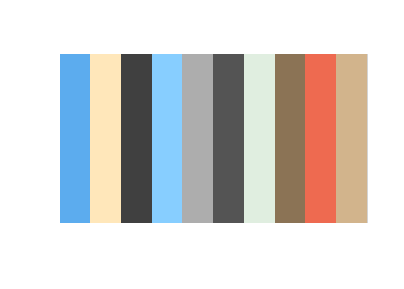
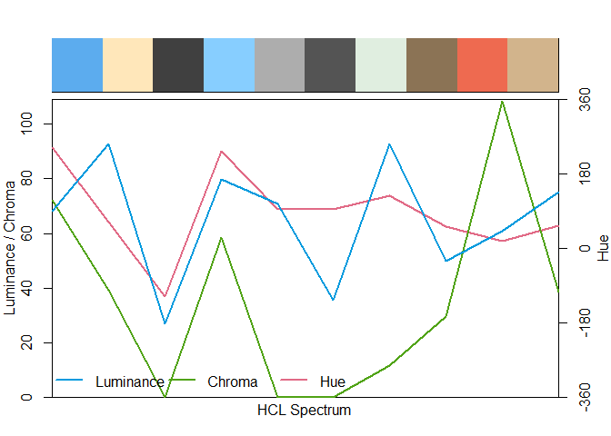
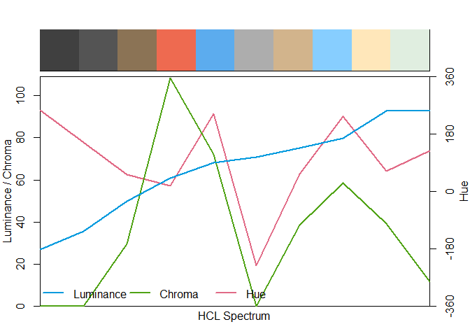
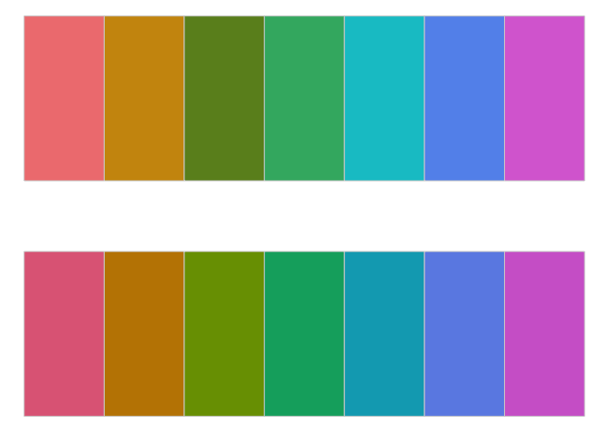

<!-- README.md is generated from README.Rmd. Please edit that file -->

# chromascope

<!-- badges: start -->

<!-- badges: end -->

The goal of chromascope is to explore colours() and find interesting set
of colours.

## Installation

You can install the development version of chromascope like so:

``` r
# install.packages('devtools')
devtools::install_github('njtierney/chromascope')
```

## Example

chromascope provides functions to extract colour data from colours().

``` r
library(chromascope)
#> 
#> Attaching package: 'chromascope'
#> The following object is masked from 'package:grDevices':
#> 
#>     col2rgb
```

``` r
# Extract the hex code for the colour "red"
col2hex("red")
#> [1] "#FF0000"
```

``` r
# Extract the hue, chroma, and luminance (hcl) data for the colour "red"
col2hcl("red")
#>            h       c        l
#> [1,] 12.1744 179.049 53.24079
```

``` r
# Extract the red, green, and blue (rgb) data for the colour "red"
col2rgb("red")
#>        r g b
#> [1,] 255 0 0
```

``` r
# Extract the hex code, hcl and rgb data for the colour "red".
colour_data("red")
#> # A tibble: 1 × 8
#>   name  hex       hue chroma luminance   red green  blue
#>   <chr> <chr>   <dbl>  <dbl>     <dbl> <int> <int> <int>
#> 1 red   #FF0000  12.2   179.      53.2   255     0     0
```

## Example for vectors of colours

chromascope can work with vectors as well.

``` r
set.seed(19-11-2025)
random_cols <- sample(colours(), 10)
```

``` r
col2hex(random_cols)
#>  [1] "#5CACEE" "#FFE7BA" "#404040" "#87CEFF" "#ADADAD" "#545454" "#E0EEE0"
#>  [8] "#8B7355" "#EE6A50" "#D2B48C"
```

``` r
col2rgb(random_cols)
#>         r   g   b
#>  [1,]  92 172 238
#>  [2,] 255 231 186
#>  [3,]  64  64  64
#>  [4,] 135 206 255
#>  [5,] 173 173 173
#>  [6,]  84  84  84
#>  [7,] 224 238 224
#>  [8,] 139 115  85
#>  [9,] 238 106  80
#> [10,] 210 180 140
```

``` r
col2hcl(random_cols)
#>               h            c        l
#>  [1,] 242.67437 7.216838e+01 67.98380
#>  [2,]  63.68084 3.926813e+01 92.55687
#>  [3,]  21.80629 3.930111e-03 27.09342
#>  [4,] 235.86258 5.864406e+01 79.90310
#>  [5,]  21.80629 1.025919e-02 70.72486
#>  [6,]  21.80629 5.182067e-03 35.72415
#>  [7,] 127.65937 1.154946e+01 92.74129
#>  [8,]  53.88507 2.949128e+01 49.98626
#>  [9,]  18.61190 1.084618e+02 60.84313
#> [10,]  56.07598 3.873112e+01 74.97572
```

``` r
colour_data(random_cols)
#> # A tibble: 10 × 8
#>    name       hex       hue    chroma luminance   red green  blue
#>    <chr>      <chr>   <dbl>     <dbl>     <dbl> <int> <int> <int>
#>  1 steelblue2 #5CACEE 243.   72.2          68.0    92   172   238
#>  2 wheat1     #FFE7BA  63.7  39.3          92.6   255   231   186
#>  3 grey25     #404040  21.8   0.00393      27.1    64    64    64
#>  4 skyblue1   #87CEFF 236.   58.6          79.9   135   206   255
#>  5 grey68     #ADADAD  21.8   0.0103       70.7   173   173   173
#>  6 grey33     #545454  21.8   0.00518      35.7    84    84    84
#>  7 honeydew2  #E0EEE0 128.   11.5          92.7   224   238   224
#>  8 burlywood4 #8B7355  53.9  29.5          50.0   139   115    85
#>  9 coral2     #EE6A50  18.6 108.           60.8   238   106    80
#> 10 tan        #D2B48C  56.1  38.7          75.0   210   180   140
```

## Visualise the colours on specplot() and swatchplot()

``` r
library(colorspace)

random_cols <- colour_data(random_cols)

swatchplot(random_cols$name)
```



``` r
specplot(random_cols$hex)
```



``` r
# Arrange the random colours based on the hue and visualise using specplot()
library(dplyr)
#> 
#> Attaching package: 'dplyr'
#> The following objects are masked from 'package:stats':
#> 
#>     filter, lag
#> The following objects are masked from 'package:base':
#> 
#>     intersect, setdiff, setequal, union

random_cols |>
  arrange(luminance) |>
  pull(hex) |>
  specplot()
```



``` r

random_cols |>
  arrange(chroma) |>
  pull(hex) |>
  specplot()
```


``` r

random_cols |>
  arrange(hue) |>
  pull(hex) |>
  specplot()
```


# Find nearest R colours

``` r
library(colorspace)
qual_cols <- qualitative_hcl(7)
qual_cols
#> [1] "#E16A86" "#C18500" "#799D00" "#00AB6E" "#00A9BE" "#6C8EE6" "#D169D0"
swatchplot(qual_cols)
```


``` r
near_qual_cols <- nearest_colour(qual_cols)
near_qual_cols
#> # A tibble: 7 × 3
#>   name_base      hex_base hex_input
#>   <chr>          <chr>    <chr>    
#> 1 lightcoral     #F08080  #E16A86  
#> 2 darkgoldenrod3 #CD950C  #C18500  
#> 3 olivedrab      #6B8E23  #799D00  
#> 4 mediumseagreen #3CB371  #00AB6E  
#> 5 turquoise3     #00C5CD  #00A9BE  
#> 6 cornflowerblue #6495ED  #6C8EE6  
#> 7 orchid         #DA70D6  #D169D0

library(dplyr)

near_qual_cols |> 
  pull(hex_base) |> 
  swatchplot(qual_cols)
```



``` r

near_qual_cols |> 
  pull(hex_base) |> 
  specplot(qual_cols)
```


